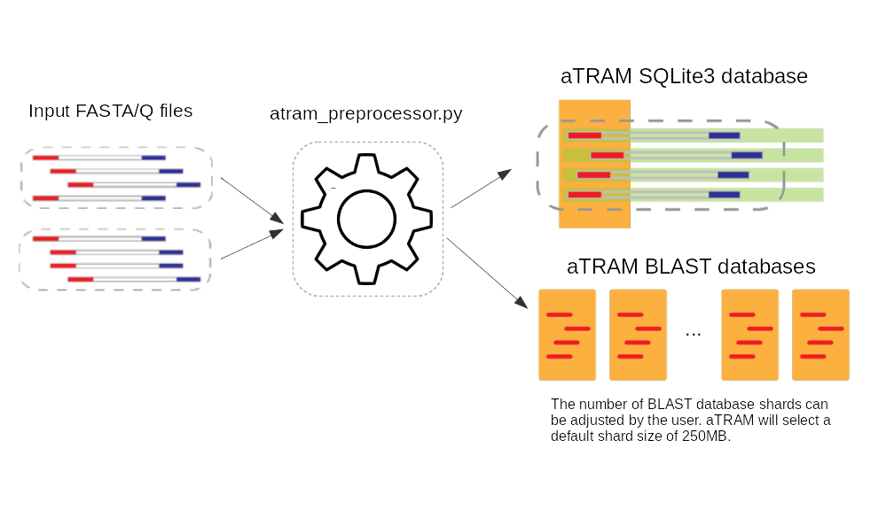

# aTRAM: *automated* Target Restricted Assembly Method

aTRAM is an iterative assembler that performs reference-guided local *de novo*
assemblies using a variety of available methods. It is well-suited to various
tasks where Next-Generation Sequencing (NGS) data needs to be queried for gene
sequences, such as phylogenomics. It is actually a suite of programs:

1. [atram_preprocessor.py](#atram_preprocessor.py): Builds a set of databases
from your input NGS sequences. One is an SQLite3 database that holds the
original NGS sequences. It also creates a set of BLAST databases for finding
sequence matches.

2. [atram.py](#atram.py): Uses the databases from step 1 along with a reference
sequence (aka a bait sequence) and a *de novo* assembler program. It's the part
of aTRAM that actually builds the assemblies.
    1. [BLAST bait sequences against the aTRAM BLAST databases](#BLAST-bait-sequences-against-the-aTRAM-BLAST-databases)
    1. [Find mate pairs to in the aTRAM SQLite3 database for all of the BLAST hits](#Find-mate-pairs-to-in-the-aTRAM-SQLite3-database-for-all-of-the-BLAST-hits)
    1. [Use a *de novo* assembler to build contigs](#Use-a-*de-novo*-assembler-to-build-contigs)
    1. [Assembled contigs become the new bait sequences for the next iteration](#Assembled-contigs-become-the-new-bait-sequences-for-the-next-iteration)

3. [atram_stitcher.py](#atram_stitcher.py): Takes the assemblies from atram.py
and joins them together. It also uses an iterative approach and the
Exonerate program.

## atram_preprocessor.py

This program reads a series of related FASTA or FASTQ files and builds an aTRAM
database. This aTRAM database is actually two or more databases
(typically several).

- An SQLite3 database that holds the contents of the FASTA/FASTQ files in a
format that can be easily and quickly queried. It takes three pieces of
information from the original files are: the sequence name, sequence end
(1, 2, or none), and the sequence itself.

- A set of BLAST databases. atram.py uses multiple BLAST databases. This
dataset division enables parallelized read queries and greatly improves
performance even for serial queries.

- Note: That during the assembly process, in atram.py, other **temporary**
SQLite3 and BLAST databases will also be built.

## atram.py

This is the heart of aTRAM. This program performs the actual gene assembly.
There are many options and knobs for atram.py but the basic algorithm is:

### BLAST bait sequences against the aTRAM BLAST databases

BLAST the input bait sequence against the BLAST databases created by
atram_preprocessor.py. This will yield a subset of your original FASTA/Q input
sequences that match the bait sequence.

For the first iteration we choose what to blast against. Either DNA or amino
acid sequences. Using amino acid sequences allows you to look for more
distantly related taxa. All subsequent iterations will use the output from the
assembler. The input bait sequences are in FASTA/Q format.

### Find mate pairs to in the aTRAM SQLite3 database for all of the BLAST hits

Now that we have a set of BLAST hits and we want to assemble contigs out of
them but we also want to consider any matching ends during the new assembly.
That is, if an end 1 matches we pull in the end 2 and *vice versa*. We know
that both ends come from the same sequence but only one end might be covered
the target sequence we want to pull in the other end to help with the assembly
process.

### Use a *de novo* assembler to build contigs

Contigs are built up using any one of the following assemblers: Velvet,
Trinity, Abyss, or Spades. Further, because the reads are assembled *de novo*,
the assemblies are not as tightly restricted to the reference sequence.
Therefore, inversions or other structural differences in the newly sequenced
genome will be revealed.

### Assembled contigs become the new bait sequences for the next iteration

Assemblies are improved by an iterative approach: in the second iteration, the
assembled contigs replace the original query, and are blasted against the
short read database. Matching reads are then assembled *de novo* as in the
first iteration. This process continues until the user-specified iteration
limit is reached or no new contigs are assembled.

## atram_stitcher.py

This program takes the contigs assembled by atram.py and stitches them into
longer sequences.

Given:
- The assembled contigs from atram.py
- a text file of all your taxon names
- a fasta file of all the reference genes in amino acids
- the program exonerate - 
https://www.ebi.ac.uk/about/vertebrate-genomics/software/exonerate-user-guide

The taxon and gene names must correspond to the assembly file names. For
example the assemblies from atram2.0 will produce a fasta file with the gene
name followed by the taxon name. The taxon names and the gene names in the
amino acid file must correspond.

This program will group all of the taxa for each gene together. It will use the
program exonerate and your amino acid reference file to find exon positions in
the assemblies. It will then stitch those exons together. If there is a missing
exon then the script will add groups of 3 NNNs in the missing places so that in
the end, there will be 1 file for each gene with all of the exons for each
taxon and with NNNS in the missing pieces. Therefore all of the exon lengths
for each taxa are roughly the same, barring indels and ready for alignment
steps.

